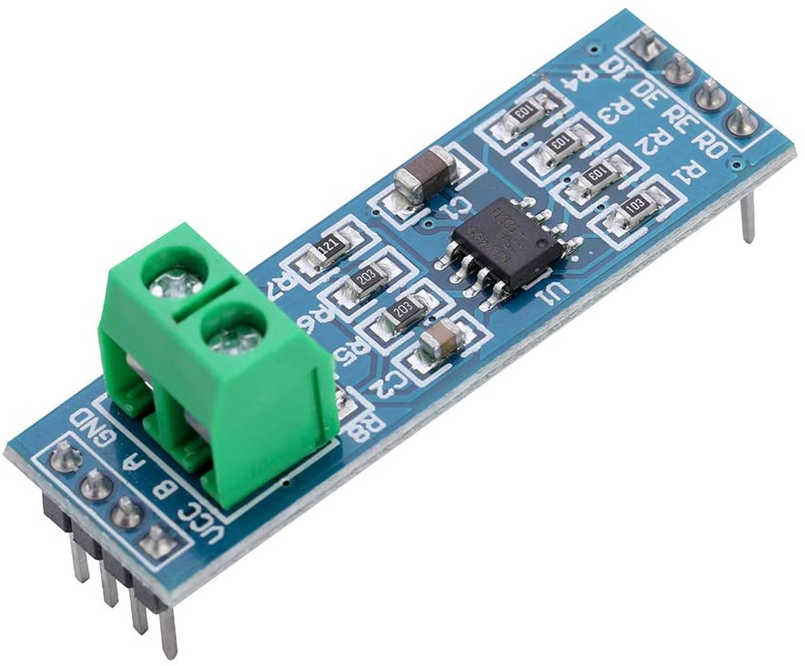

The MAX485 TTL to RS-485 Interface Module allows uCs to use the RS-485 differential signaling for robust long distance serial communications.

Technical Specifications:
Working Voltage: 5V
Main Chip: MAX485
Distances: up to 1200 meters
Speeds: up to 2.5Mbit/Sec
Multi-drop supports: up to 32 devices on same bus
Uses differential signaling for noise immunity
On board 5.08(mm) 2P connector for RS 485 wires
All the pins of the chip are brought out, can be controlled by MCU
Board size: 46mm x 12mm / 1.81”x 0.47”

PINOUT:
- VCC........5V
- A............Non-inverting Receiver Input and No-ninverting Driver Output
- B............Inverting Receiver Input and Inverting Driver Output
- GND.......0V
- R0..........Receiver Output (to Rx pin of micro controller)
- RE..........Receiver Output Enable (Low to enable)
- DE..........Driver Output Enable (high to enable)
- DI...........Driver Input (to Tx pin of micro controller)

